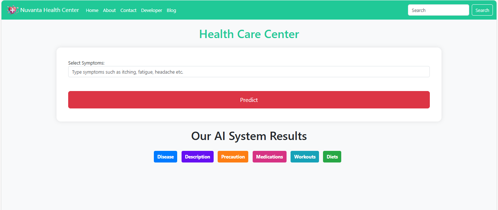

# 🩺 Drug Recommendation System using SVM
This project is a machine learning-based web application that predicts diseases from a list of symptoms and recommends drugs or treatment advice. It uses Support Vector Machine (SVM) as the core classifier and is served via a lightweight Flask backend.

# ✅ Features
- Predicts disease based on input symptoms

- Recommends appropriate medications or treatments

- Built using SVM with accuracy of 100%

- Web interface using Flask

- Model saved and loaded with Pickle

# 🧠 Model Training Details
- Algorithms Tried: SVM, RandomForest, GradientBoosting, KNN, MultinomialNB

- Accuracy: 100% on all models

- Final Model Used: SVM (Support Vector Machine)

- Features: Binary-encoded symptoms (e.g., itching, skin_rash, shivering, etc.)

- Label: prognosis (disease)
# 🖥️ Screenshots
🔹 Input Page 
Users input symptoms 

           
# 🧑‍💻 Technologies Used
- Python

- Flask

- Scikit-learn

- HTML/CSS (Bootstrap optional)

- Pickle

